<div align="center">
  
  
  # Mofumofu
  
  **A soft and simple social blogging platform for everyone**
  
  *"Mofumofu" (もふもふ) - Japanese for something soft and fluffy*
  
  [](https://opensource.org/licenses/Apache-2.0)
  [](https://www.rust-lang.org/)
  [](https://svelte.dev)
  [](https://postgresql.org/)
  [](https://docker.com/)

</div>

---

## 🌟 Overview

Mofumofu is a modern, open-source social blogging platform designed for genuine thought and expression. Built with a microservices architecture using Rust, Svelte, and cutting-edge technologies, it prioritizes clarity, ownership, and simplicity over engagement metrics.

### ✨ Why Mofumofu?

- **🔐 Privacy-First**: Your data, your control
- **📱 Modern Experience**: Beautiful, responsive design
- **⚡ High Performance**: Built with Rust and optimized for speed
- **🌍 Multi-Platform**: Web, desktop, and mobile ready
- **🎨 Rich Content**: Markdown support with math, syntax highlighting
- **🔍 Smart Search**: Full-text search powered by Meilisearch
- **🌐 International**: Multi-language support out of the box

---

## 🏗️ Architecture

Mofumofu follows a modern **microservices architecture** with clear separation of concerns:

```mermaid
graph TB
    subgraph "Frontend Layer"
        UI[🌐 Web UI<br/>SvelteKit]
        DESKTOP[🖥️ Desktop App<br/>Tauri]
    end

    subgraph "API Gateway"
        GATEWAY[🚪 Load Balancer<br/>Caddy/Cloudflare]
    end

    subgraph "Core Backend Services"
        API[🦀 Main API<br/>Rust + Axum<br/>Port: 8000]
        TASKS[🐍 Tasks API<br/>Python + FastAPI<br/>Port: 7000]
        MARKDOWN[📝 Markdown Service<br/>Bun + Elysia<br/>Port: 6700]
    end

    subgraph "Background Processing"
        WORKER[⚙️ Celery Workers<br/>Cron, Search]
        BEAT[📅 Celery Beat<br/>Scheduled Tasks]
        FLOWER[🌸 Flower<br/>Task Monitor]
    end

    subgraph "Data & Storage Layer"
        POSTGRES[(🐘 PostgreSQL<br/>Primary Database)]
        REDIS[(🔴 Redis<br/>Cache & Broker)]
        SEARCH[(🔍 Meilisearch<br/>Full-text Search)]
        R2[☁️ Cloudflare R2<br/>File Storage]
    end

    UI --> GATEWAY
    DESKTOP --> GATEWAY
    GATEWAY --> API
    API --> TASKS
    API --> MARKDOWN
    API --> POSTGRES
    API --> REDIS
    API --> SEARCH

    TASKS --> WORKER
    TASKS --> BEAT
    WORKER --> FLOWER

    WORKER --> POSTGRES
    WORKER --> SEARCH
    WORKER --> R2

    API --> R2
```



### 🧩 Component Overview

| Component            | Technology                           | Purpose                                 | Port           |
| -------------------- | ------------------------------------ | --------------------------------------- | -------------- |
| **Web UI**           | SvelteKit 5, TypeScript, TailwindCSS | User interface and experience           | 5173(dev)      |
| **Desktop App**      | Tauri + Svelte                       | Native desktop application              | -              |
| **Main API**         | Rust + Axum + SeaORM                 | Core business logic and REST API        | 8000           |
| **Tasks API**        | Python + FastAPI + Celery            | Background task processing              | 7000(internal) |
| **Markdown Service** | Bun + Elysia                         | High-performance markdown rendering     | 6700(internal) |
| **Celery Workers**   | Python + Celery                      | Async image processing, search indexing | -              |
| **PostgreSQL**       | Database                             | Primary data storage                    | 5432(internal) |
| **Redis**            | Cache/Broker                         | Session storage, task queue             | 6379(internal) |
| **Meilisearch**      | Search Engine                        | Full-text search and indexing           | 7700(internal) |
| **Cloudflare R2**    | Object Storage                       | Image and file storage                  | -              |

---

## 🚀 Quick Start

### 🐳 Docker Compose (Recommended)

The fastest way to get Mofumofu running locally:

```bash
# Clone the repository
git clone https://github.com/levish0/mofumofu.git
cd mofumofu

# Start all services
docker-compose up --build

# Or run in detached mode
docker-compose up -d --build
```

**Services will be available at:**

- 🌐 **Web UI**: http://localhost:5173
- 📚 **API Docs**: http://localhost:8000/docs
- ⚙️ **Task Monitor**: http://localhost:5555
- 🔍 **Search Engine**: http://localhost:7700

### ⚙️ Manual Development Setup

For active development on individual components:

#### 1. Backend Services

```bash
# Main API (Rust)
cd mofumofu-backend
cp .env.example .env
# Edit .env with your configuration

# Run database migrations
cd migration && cargo run

# Start the API server
cargo run

# Tasks API (Python) - separate terminal
cd mofumofu-backend/tasks
uv sync
uv run fastapi dev app/main.py

# Start Celery worker - separate terminal
python start_worker.py

# Markdown Service (Bun) - separate terminal
cd mofumofu-backend/markdown-service
bun install && bun run dev
```

#### 2. Frontend

```bash
# Web UI (Svelte)
cd mofumofu-ui
pnpm install
pnpm dev

# Desktop App (Tauri) - optional
cd mofumofu-desktop
pnpm install
pnpm tauri dev
```

#### 3. Infrastructure

```bash
# PostgreSQL
docker run --name postgres \
  -e POSTGRES_PASSWORD=password \
  -p 5432:5432 -d postgres:15

# Redis
docker run --name redis -p 6379:6379 -d redis:8

# Meilisearch
docker run --name meilisearch \
  -p 7700:7700 -d getmeili/meilisearch:latest
```

---

## 📁 Project Structure

```
mofu/
├── 🌐 mofumofu-ui/          # Frontend (SvelteKit + TypeScript)
│   ├── src/lib/components/  # Reusable UI components
│   ├── src/lib/api/         # API client and types
│   ├── src/lib/stores/      # Global state management
│   ├── src/routes/          # Application routes
│   └── messages/            # Internationalization
│
├── 🦀 mofumofu-backend/     # Backend Services
│   ├── src/                 # Main API (Rust + Axum)
│   │   ├── api/v0/routes/   # REST API endpoints
│   │   ├── service/         # Business logic layer
│   │   ├── repository/      # Data access layer
│   │   ├── entity/          # Database models (SeaORM)
│   │   └── middleware/      # Auth, CORS, etc.
│   │
│   ├── tasks/               # Background Tasks (Python)
│   │   ├── app/api/routes/  # Task API endpoints
│   │   ├── app/tasks/       # Celery task definitions
│   │   └── app/services/    # Task business logic
│   │
│   ├── markdown-service/    # Markdown Processing (Bun)
│   │   └── src/             # Markdown rendering service
│   │
│   └── migration/           # Database Migrations
│       └── src/             # SeaORM migration files
│
├── 🖥️ mofumofu-desktop/     # Desktop App (Tauri + Svelte)
│   ├── src-tauri/           # Rust backend for desktop
│   └── src/                 # Svelte frontend
│
├── 🎨 assets/               # Brand assets and images
└── 📄 Documentation        # Project documentation
```

---

## 🛠️ Technology Stack

### Frontend Technologies

- **[SvelteKit 5](https://kit.svelte.dev/)** - Full-stack web framework with runes
- **[TypeScript](https://www.typescriptlang.org/)** - Type-safe development
- **[TailwindCSS 4](https://tailwindcss.com/)** - Utility-first styling
- **[Tauri](https://tauri.app/)** - Desktop application framework
- **[Vite](https://vitejs.dev/)** - Modern build tool and dev server

### Backend Technologies

- **[Rust](https://www.rust-lang.org/)** - Systems programming language
- **[Axum](https://github.com/tokio-rs/axum)** - Modern async web framework
- **[SeaORM](https://www.sea-ql.org/SeaORM/)** - Async ORM with migrations
- **[Python](https://python.org/)** - Scripting and task processing
- **[FastAPI](https://fastapi.tiangolo.com/)** - High-performance Python API
- **[Celery](https://docs.celeryq.dev/)** - Distributed task queue
- **[Bun](https://bun.sh/)** - Fast JavaScript runtime

### Infrastructure & Services

- **[PostgreSQL](https://postgresql.org/)** - Primary relational database
- **[Redis](https://redis.io/)** - In-memory data store and message broker
- **[Meilisearch](https://www.meilisearch.com/)** - Fast full-text search engine
- **[Cloudflare R2](https://www.cloudflare.com/products/r2/)** - Object storage
- **[Docker](https://docker.com/)** - Containerization and deployment

---

## ✨ Features

### 🔐 Authentication & Security

- **JWT-based Authentication** with refresh tokens
- **OAuth Integration** (Google, GitHub) with account linking
- **Password Management** (set, reset, change) with email verification
- **Email Verification** system with token-based validation
- **Secure Session Management** with automatic cleanup

### 👥 Social Blogging Features

- **Rich Post Creation** with markdown, math, and code syntax highlighting
- **Image Upload & Processing** with automatic WebP conversion and optimization
- **Social Interactions** - Follow/unfollow users, like posts
- **Real-time Search** with full-text indexing and instant results
- **Trending Hashtags** with intelligent popularity algorithms
- **User Profiles** with customizable avatars, banners, and bio

### 🚀 Performance & Scalability

- **Microservices Architecture** with independent scaling
- **Background Task Processing** for heavy operations
- **Intelligent Caching** with Redis for improved response times
- **Database Optimization** with connection pooling and query optimization
- **CDN Integration** for global content delivery
- **Real-time Features** with efficient state synchronization

### 🌍 Developer Experience

- **Comprehensive API Documentation** with interactive Swagger UI
- **Multi-language Support** (English, Korean, Japanese, German, French, Spanish, Russian)
- **Type-safe Development** with full TypeScript and Rust type checking
- **Hot Reloading** for rapid development cycles
- **Structured Error Handling** with detailed error codes and messages
- **Extensive Testing** with unit, integration, and end-to-end tests

---

## 📚 API Documentation

### REST API Endpoints

**Base URL**: `http://localhost:8000/v0`

#### Authentication

```http
POST   /auth/sign_up           # User registration
POST   /auth/sign_in           # User login
POST   /auth/refresh           # Token refresh
DELETE /auth/sign_out          # Logout
POST   /auth/verify_email      # Email verification
POST   /auth/forgot_password   # Password reset request
POST   /auth/reset_password    # Reset password with token
```

#### OAuth Integration

```http
GET    /auth/google            # Google OAuth flow
GET    /auth/github            # GitHub OAuth flow
POST   /auth/link_oauth        # Link OAuth account
DELETE /auth/unlink-oauth      # Unlink OAuth account
GET    /auth/oauth-connections # Get connected accounts
```

#### Content Management

```http
POST   /post                   # Create new post
GET    /post/:id               # Get post by ID
PUT    /post/:id               # Update post
DELETE /post/:id               # Delete post
GET    /post/user/:handle      # Get user's posts
POST   /post/search            # Search posts
POST   /post/image             # Upload post image
```

#### Social Features

```http
POST   /follow                 # Follow user
DELETE /follow                 # Unfollow user
GET    /follow/followers       # Get followers list
GET    /follow/following       # Get following list
POST   /like                   # Like post
DELETE /like                   # Unlike post
GET    /hashtag/trending       # Get trending hashtags
```

### Interactive Documentation

- **📖 Main API**: http://localhost:8000/docs
- **⚙️ Tasks API**: http://localhost:7000/docs
- **📝 ReDoc**: http://localhost:8000/redoc

---

## 🔧 Development

### Prerequisites

- **Rust** 1.86.0+
- **Node.js** 18+ with **pnpm**
- **Python** 3.10+ with **uv**
- **Bun** 1.0+
- **PostgreSQL** 17+
- **Redis** 8+
- **Docker & Docker Compose** (recommended)

### Development Workflow

#### Backend Development

```bash
# Quick type checking (recommended for development)
cd mofumofu-backend && cargo check

# Run tests
cargo test

# Code quality
cargo clippy && cargo fmt

# Database operations
cd migration && cargo run      # Run migrations
cd migration && cargo run -- refresh  # Reset DB
```

#### Frontend Development

```bash
cd mofumofu-ui

# Development server with hot reload
pnpm dev

# Type checking
pnpm check

# Code formatting
pnpm fmt && pnpm lint
```

#### Task System Development

```bash
cd mofumofu-backend/tasks

# Install dependencies
uv sync

# Start services
uv run fastapi dev app/main.py  # Tasks API
python start_worker.py          # Celery worker
python monitor_celery.py        # Flower monitoring

# Code quality
uv run ruff check . --fix
uv run ruff format .
```

### Testing

```bash
# Backend tests (Rust)
cargo test
cargo test --test integration_tests

# Frontend tests (if available)
cd mofumofu-ui && pnpm test

# Python tests
cd mofumofu-backend/tasks && uv run pytest
```

### Monitoring & Debugging

```bash
# View logs
docker-compose logs -f mofumofu-backend
docker-compose logs -f celery-worker

# Health checks
curl http://localhost:8000/health    # Main API
curl http://localhost:7000/health    # Tasks API
curl http://localhost:6700/health    # Markdown service

# Task monitoring
# Visit http://localhost:5555 (Flower UI)
```

---

## 🚀 Deployment

### Production Docker Deployment

```bash
# Production configuration
cp deploy_docker-compose.yml docker-compose.yml

# Configure environment variables
cp .env.example .env
# Edit .env with production settings

# Deploy all services
docker-compose up -d --build

# Scale workers
docker-compose up -d --scale celery-worker=4

# Monitor deployment
docker-compose ps
docker-compose logs -f
```

### Individual Service Deployment

```bash
# Backend API
cd mofumofu-backend
docker build -t mofumofu-backend .
docker run -p 8000:8000 --env-file .env mofumofu-backend

# Frontend (Build for Cloudflare Workers)
cd mofumofu-ui
pnpm build
# Deploy to Cloudflare Workers, Netlify, or Vercel

# Desktop App
cd mofumofu-desktop
pnpm tauri build
# Distributable binaries will be in src-tauri/target/release/bundle/
```

### Environment Configuration

Create production environment files:

**Backend (.env)**

```env
ENVIRONMENT=production
JWT_SECRET=your-super-secure-jwt-secret-key
POSTGRES_HOST=your-postgres-host
POSTGRES_PASSWORD=your-secure-password
R2_ACCESS_KEY_ID=your-cloudflare-r2-key
R2_SECRET_ACCESS_KEY=your-cloudflare-r2-secret
MEILISEARCH_API_KEY=your-meilisearch-master-key
CORS_ALLOWED_ORIGINS=https://yourdomain.com
```

**Frontend (.env.local)**

```env
PUBLIC_API_URL=https://api.yourdomain.com
```

---

## 🌍 Internationalization

Mofumofu supports multiple languages out of the box:

- 🇺🇸 **English** (default)
- 🇰🇷 **Korean** (한국어)
- 🇯🇵 **Japanese** (日本語)
- 🇩🇪 **German** (Deutsch)
- 🇫🇷 **French** (Français)
- 🇪🇸 **Spanish** (Español)
- 🇲🇽 **Spanish (Mexico)** (Español)
- 🇷🇺 **Russian** (Русский)

### Adding New Languages

```bash
cd mofumofu-ui

# Add new language file
echo '{}' > messages/new-language.json

# Update inlang configuration
# Edit project.inlang/settings.json

# Generate translations
pnpm run para:build
```

---

## 🤝 Contributing

We welcome contributions from developers of all skill levels! Here's how to get started:

### 🚀 Getting Started

1. **Fork** the repository
2. **Clone** your fork: `git clone https://github.com/levish0/mofumofu.git`
3. **Create** a feature branch: `git checkout -b feature/amazing-feature`
4. **Set up** your development environment (see [Development](#development))
5. **Make** your changes and test them
6. **Commit** using [Conventional Commits](https://www.conventionalcommits.org/): `git commit -m "feat: add amazing feature"`
7. **Push** to your branch: `git push origin feature/amazing-feature`
8. **Open** a Pull Request

### 📝 Development Guidelines

**Code Quality:**

- Follow language-specific conventions (Rust, TypeScript, Python)
- Write tests for new features
- Update documentation for API changes
- Use provided linting and formatting tools

**Commit Standards:**

- Use Conventional Commits format
- Examples: `feat:`, `fix:`, `docs:`, `refactor:`, `test:`
- Keep commits focused and atomic

**Pull Request Requirements:**

- All tests must pass
- Code must pass linting checks
- Include screenshots for UI changes
- Update relevant documentation
- Link related issues

### 🐛 Bug Reports

Found a bug? Help us fix it:

1. Check if it's already reported in [Issues](https://github.com/levish0/mofumofu/issues)
2. Create a detailed bug report with:
   - Steps to reproduce
   - Expected vs actual behavior
   - Screenshots or logs
   - Environment details

### 💡 Feature Requests

Have an idea? We'd love to hear it:

1. Check existing [Feature Requests](https://github.com/levish0/mofumofu/discussions)
2. Open a new discussion with:
   - Clear description of the feature
   - Use cases and benefits
   - Possible implementation approach

---

## 📄 License

This project is licensed under the **Apache License 2.0**.

```
Copyright 2024 Mofumofu Contributors

Licensed under the Apache License, Version 2.0 (the "License");
you may not use this file except in compliance with the License.
You may obtain a copy of the License at

    http://www.apache.org/licenses/LICENSE-2.0

Unless required by applicable law or agreed to in writing, software
distributed under the License is distributed on an "AS IS" BASIS,
WITHOUT WARRANTIES OR CONDITIONS OF ANY KIND, either express or implied.
See the License for the specific language governing permissions and
limitations under the License.
```

See [LICENSE](./LICENSE) for the full license text.

---

## 🙏 Acknowledgments

### Core Technologies

- [**Rust**](https://www.rust-lang.org/) - Systems programming language that prioritizes safety and performance
- [**Svelte**](https://svelte.dev/) - Cybernetically enhanced web apps with excellent developer experience
- [**PostgreSQL**](https://postgresql.org/) - The world's most advanced open source database
- [**Redis**](https://redis.io/) - In-memory data structure store for blazing-fast operations
- [**Docker**](https://docker.com/) - Containerization platform that streamlines deployment

### Special Thanks

- **Open Source Community** - For the incredible tools and libraries that make Mofumofu possible
- **Contributors** - Everyone who helps make Mofumofu better
- **Beta Testers** - Early adopters who provide valuable feedback

---

## 💬 Community & Support

- **🐛 Bug Reports**: [GitHub Issues](https://github.com/levish0/mofumofu/issues)
- **💡 Feature Requests**: [GitHub Discussions](https://github.com/levish0/mofumofu/discussions)
- **📚 Documentation**: [Project Wiki](https://github.com/levish0/mofumofu/wiki)
- **💬 Community Chat**: [Discord Server]https://discord.gg/86wResmMSH)

---

<div align="center">

### 🐾 Philosophy

_We believe the internet should be a space for genuine thought and expression._

_Mofumofu doesn't optimize for engagement metrics or algorithmic reach._  
_It's built for clarity, ownership, and simplicity._

_If you're tired of the noise, Mofumofu offers a quieter place to write._

---

**Made with 💜 and lots of ☕ by levish(Levi Lim) & Community**

_Soft, simple, and genuine - just like something mofumofu (もふもふ)_

</div>
